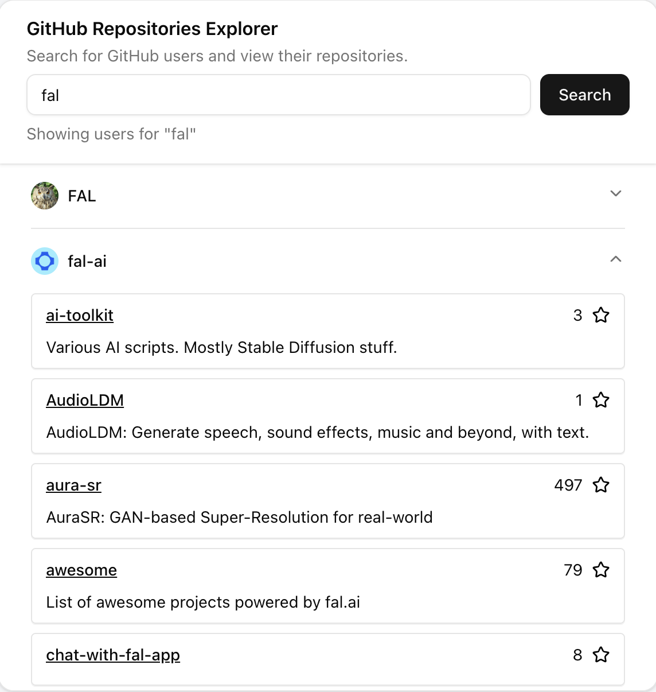

# 🔍 GitHub Repositories Explorer

A simple and elegant React + TypeScript application that allows users to search GitHub users and view their public repositories. Built using Vite, Tailwind CSS, ShadCN UI, and React Hook Form.

---

## ✨ Features

- 🔎 Search for GitHub users (up to 5 suggestions)
- 📁 View public repositories of selected users
- 📋 Repositories displayed inside interactive accordions
- 💡 Displays repository stars, description, and GitHub link
- 🌙 Clean and responsive UI using ShadCN + Tailwind
- 🔄 Loading indicators and error handling

---

## 🚀 Live Demo

🔗 [View on GitHub Pages](https://fal-hi.github.io/github-repositories-explorer)

---

## 🛠️ Tech Stack

- [React](https://react.dev/) + [TypeScript](https://www.typescriptlang.org/)
- [Vite](https://vitejs.dev/) for blazing-fast builds
- [Tailwind CSS](https://tailwindcss.com/) + [ShadCN UI](https://ui.shadcn.com/)
- [React Hook Form](https://react-hook-form.com/) for form handling

---

## 📦 Getting Started

### 1. Clone the repository

```bash
git clone https://github.com/Fal-hi/github-repositories-explorer.git
cd github-repo-explorer
```

### 2. Install dependencies

```bash
pnpm install
```

### 3. Run the app locally

```bash
pnpm run dev
```

### 4. Build for production

```bash
pnpm run build
```

### 5. Deploy app

```bash
pnpm run deploy
```

---

## 🔐 Environment Variables

Create a `.env` file in the root project:

```env
VITE_GITHUB_API=https://api.github.com
```

> Note: GitHub API v3 has rate limits. Use a token if needed.

---

## 🧪 Testing

Testing support is set up using:

- [Vitest](https://vitest.dev/)
- [React Testing Library](https://testing-library.com/)

```bash
pnpm run test
```

---

## 📁 Project Structure

```
src/
├── components/         // UI components (SearchBar, UserAccordion, etc.)
├── hooks/              // API functions (getUserRepos, searchUsers, etc.)
├── interface/          // TypeScript interfaces
├── App.tsx             // Main application
└── main.tsx            // Entry point
└── tests/components    // Testing components app
```

---

## 📸 Preview

> 

---

## 📄 License

MIT © [Syaifal Illahi](https://github.com/Fal-hi)
